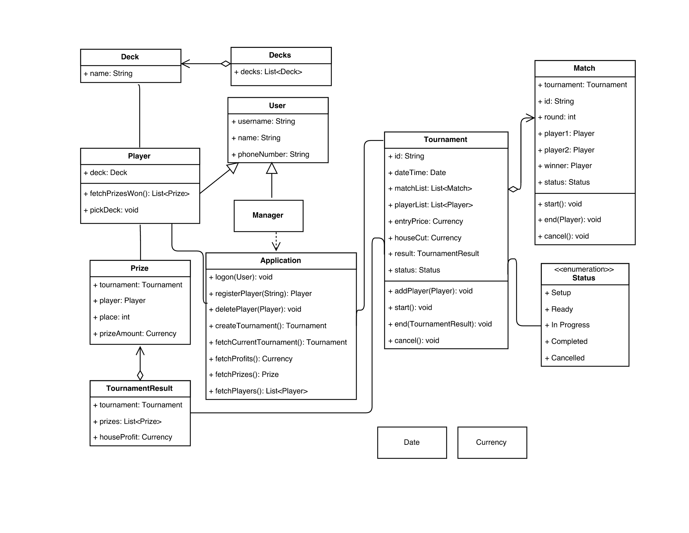
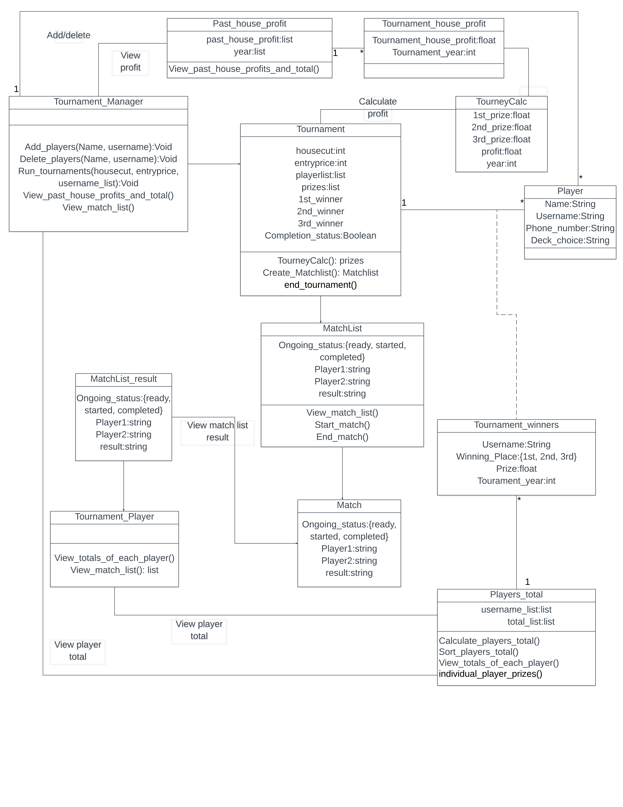

# Individual Designs
## Design 1

### Pros
This was designed so well that I didn't need to look at the design-information file to understand the flow. Good use of inheritance and Class organization, with easy to understand methods.  Made me embarrassed of uploading mine, so it gets my vote. 
### Cons
## Design 2

### Pros
Detailed structure and methods defined in the design-information.md file.  Simple to follow.
### Cons
Seemed like more Classes to implement than needed, some which only performed one or two operations.  That made it feel cluttered, I think it could have been cut down with inheritance.
- Font could be a little bigger.
## Design 3

### Pros
- Simple design that could potentially make implementation and maintenance easier
### Con
- Does not clearly define which classes the methods should be implemented in.
- Improper use of relationships
## Design 4

### Pros
Clean simplistic structure with minimal amount of Classes.  Looks easy to implement and there aren't any unnecessary attributes or operations.
- Methods are in classes that should perform the action
- Has an interface for database
### Cons
The simple design without inheritance might make it difficult to add additional functionality in the future, which I'm guessing the Professor will make us do.
- Seems risk prone with how every class is able to access the database
# Team Design
# Summary

