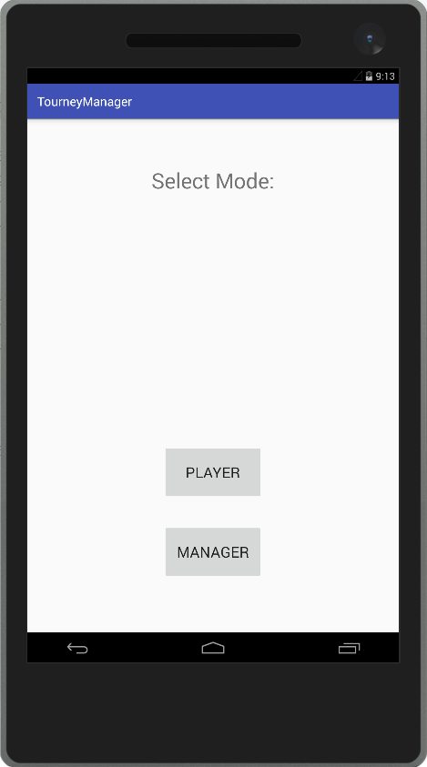
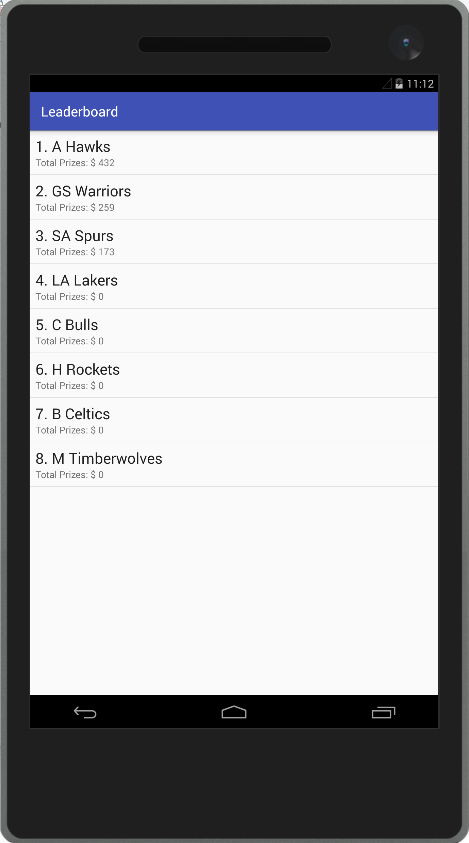
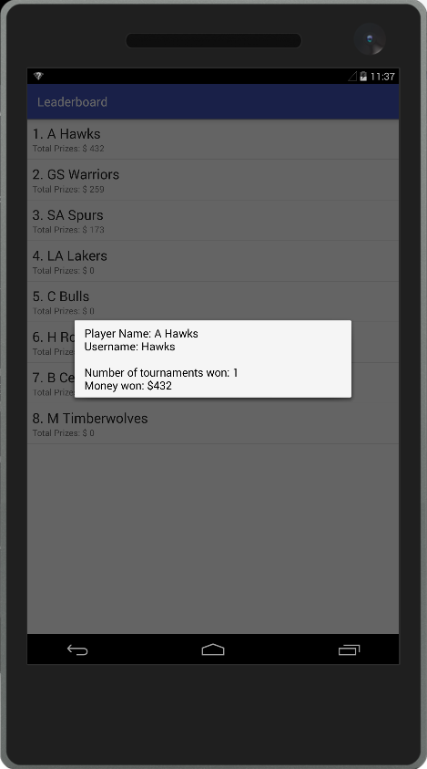
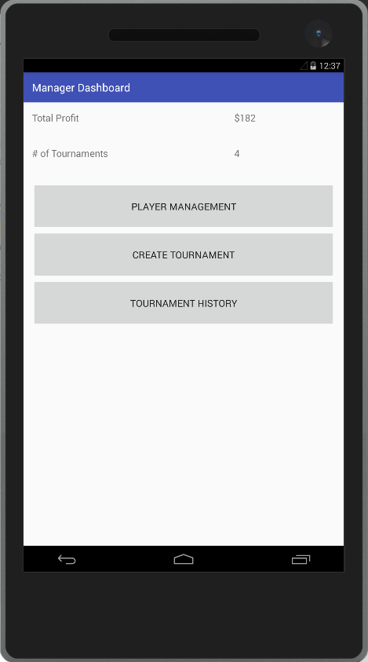
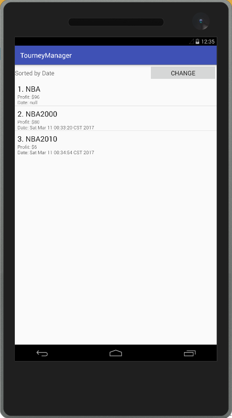

# User Manual

**Author**: Team 37 - Hi-Team

## Application Overview:

Tourney Manager is a user friendly E-gaming application that allows users to manage or participate in a single elimination tournament, with a payout for the top three winners. The application has two modes: Manager and Player. The tournament can have one manager, and either 8 or 16 players.

## Functionality Overview:

  

- **Manager mode: This mode enables the user to**

1.	Register a player to the system

2.	Remove a player from the system

3. Create a new tournament

4. Add registered players to the tournament

5. Start/cancel a tournament

6.	Manage existing tournament or 

7.	Display house profit and player prizes

- **Player mode: This mode enables the user to**

1.	View player prizes

2.	View current matches in the existing tournament

## How to use the application:

- **Manager Mode**

  

1.	Register a player to the system
  * User login with Manager mode. The player list will automatically displayed. The user then click "Add Player".  
  * The user will enter all the required information: Name, Phone Number, and Deck. Then click OK.  
  
 
 
2.	Remove a player from the system
  * User login with Manager mode. The player list will automatically displayed.
  * User clicks on the desired username that he/she wants to remove, then clicks YES or NO to confirm or cancel.    
 

3. Create a new tournament
  * If there is no existing tournament, the Create Tournament button will be available.  
  * User enter the house cut, entry price and then click on "Create Tournament".
 

4. Add registered players to the tournament
  * User click on "Player list" to add registered players participating the tournament. Please note that the amount of players is restricted to either 8 or 16.  
 
 
 
 

5. Start/cancel a tournament
  * If tournament hasn't started yet, the "Start" button will be available.  
  * User click on "Start" to generate a single elimination match list. 
  * User then click on "Match List" to view current match list.
  * The application will automatically calculate the house profit amount as well as the first, second, and third prizes based on the user inputs.
  * 
 

6.	Manage existing tournament or 
  * User click on "Action" to set-ready, start or end a match list.
  * User select winner for a match.
  * Once a winner is selected, it is automatically populated to a match in next round. 
  * 3rd place playoff match is included in the matchlist.
 
 

7.	Display house profit and player prizes
  * After all the matches are ended, user clicks on the "End" tournament button to display Prizes. 
  * The 1st, 2nd, and 3rd prizes are automatically awarded. Note that the results are rounded to the nearest integer.  
  * The user can click individual player to see the list of individual prizes.
  * The user can click tournament history to view post house profits in chronological order.
  
  
  
  

 Note that if the tournament is ended before all matches finished, the tournament will be considered invalid and the money will be refunded to players. 
 
 
- **Player Mode**

1.	View current matches in the existing tournament
  * User logon in Player Mode. And view Match list.
  * 
 

2.	View player prizes

  * User log with Player Mode. A ranking list of players with prizes will be automatically displayed.  
  
