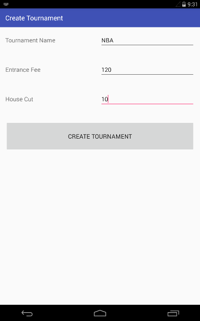
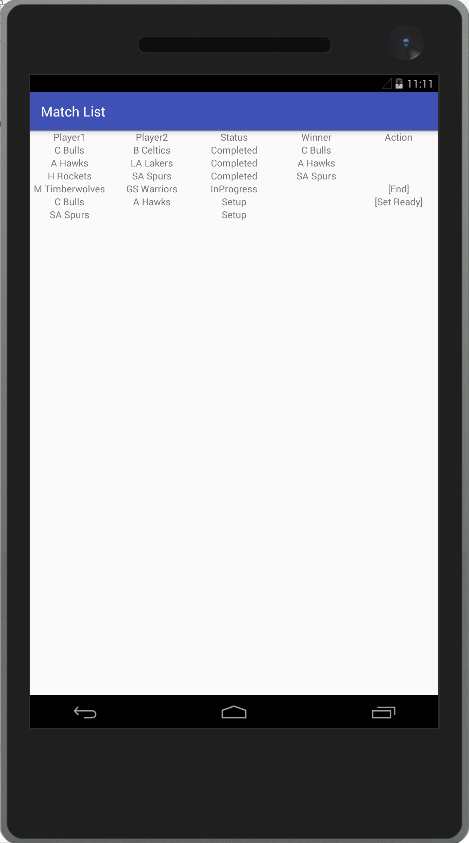
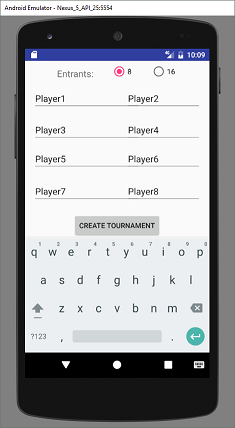
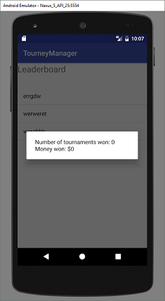

# User Manual

**Author**: Team 37 - Hi-Team

## Application Overview:

Tourney Manager is a user friendly E-gaming application that allows users to manage or participate in a single elimination tournament, with a payout for the top three winners. The application has two modes: Manager and Player. The tournament can have one manager, and either 8 or 16 players.

## Functionality Overview:

- **Manager mode: This mode enables the user to**

1.	Register a player to the system

2.	Remove a player from the system

3. Create a new tournament

4. Add registered players to the tournament

5. Start/cancel a tournament

6.	Manage existing tournament or 

7.	Display house profit and player prizes

- **Player mode: This mode enables the user to**

1.	View player prizes

2.	View current matches in the existing tournament

## How to use the application:

- **Manager Mode**

  

1.	Register a player to the system
  * User login with Manager mode. The player list will automatically displayed. The user then click "Add Player".  
  * The user will enter all the required information: Name, Phone Number, and Deck. Then click OK.  
  
 
 
2.	Remove a player from the system
  * User login with Manager mode. The player list will automatically displayed.
  * User clicks on the desired username that he/she wants to remove, then clicks YES or NO to confirm or cancel.    
 

3. Create a new tournament
  * If there is no existing tournament, the Create Tournament button will be available.  
  * User enter the house cut, entry price and then click on "Create Tournament".
 

4. Add registered players to the tournament
  * User click on "Player list" to add registered players participating the tournament. Please note that the amount of players is restricted to either 8 or 16.  
 
 
 
 

5. Start/cancel a tournament
  * If tournament hasn't started yet, the "Start" button will be available.  
  * User then click on "Start" to generate a single elimination match list. 
 
 

  * After all the information has been entered, user clicks on the Display Prizes and Profit button and the application will automatically calculate the house profit amount as well as the first, second, and third prizes based on the user inputs.
  * The house profit is calculated based on the House Cut percentage input of the total amount of money collected, which are user modifiable. For example, the 1st, 2nd, and 3rd prizes can be 50%, 30% and 20% of the prize pool remaining after the house cut. Note that the results are rounded to the nearest integer.  
  * Once the user validates the information, clicks on the Create Tournament button to create a tournament as shown below  
  

  * To manage an existing tournament, user clicks on the Manage Tournament button. In this screen, the user can begin or end matches, and assign the results.  
  * Users can end the current tournament by clicking on the End Tournament button. Note that if the tournament is ended before all matches finished, the tournament will be considered invalid and the money will be refunded to players.

4.	Display house profit and player prizes   
  * User login with Manager Mode, and Display Prizes and/or Profits

- **Player Mode**

1.	View player prizes
  * User log with Player Mode. A list of players will be automatically displayed.  
  

  * User then clicks on one player, and the prizes of this specific player will be displayed. As shown below.  
  

2.	View current matches in the existing tournament
  * User logon in Player Mode. And view Match list.
 
